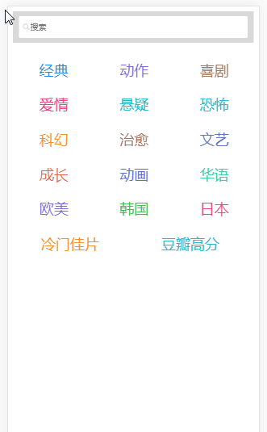
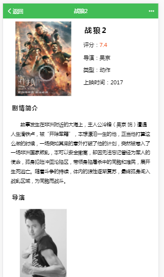

# Douban-Movie #

一个简单的移动端电影介绍网页，觉得不错可以[star一下](https://github.com/huanghaibin91/Douban-Movie)

因为是公共API对访问次数有限制，所以不要频繁点击

还有就是问题：

一个是有的时候返回数据错误会返回空白页

第二是我发现UC和QQ手机浏览器打开始空白页，移动端火狐浏览器正常，我猜想可能是不支持ES6的原因，我就在组件用了下ES6的模板字符串，这样不用写一堆转义符号

----------

## 项目描述 ##

- 使用vue + mint-ui完成页面

- 利用豆瓣公共API跨域获取数据

## 预览地址 ##

[预览地址](https://huanghaibin91.github.io/Douban-Movie/)

## 项目截图 ##

